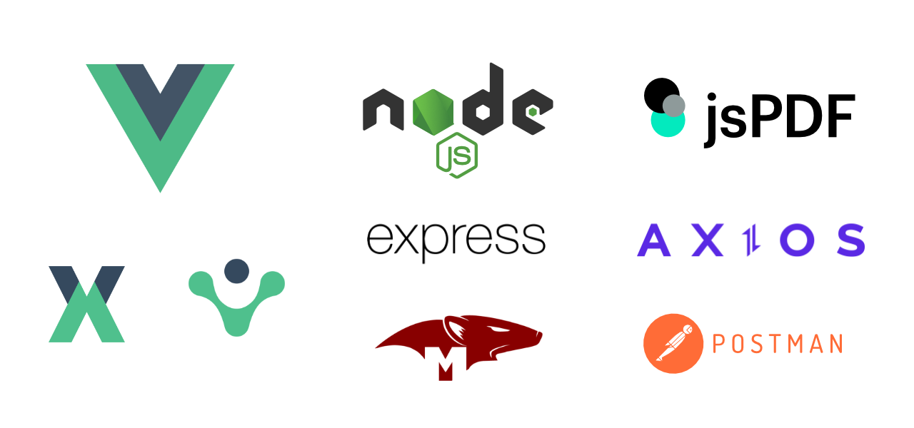
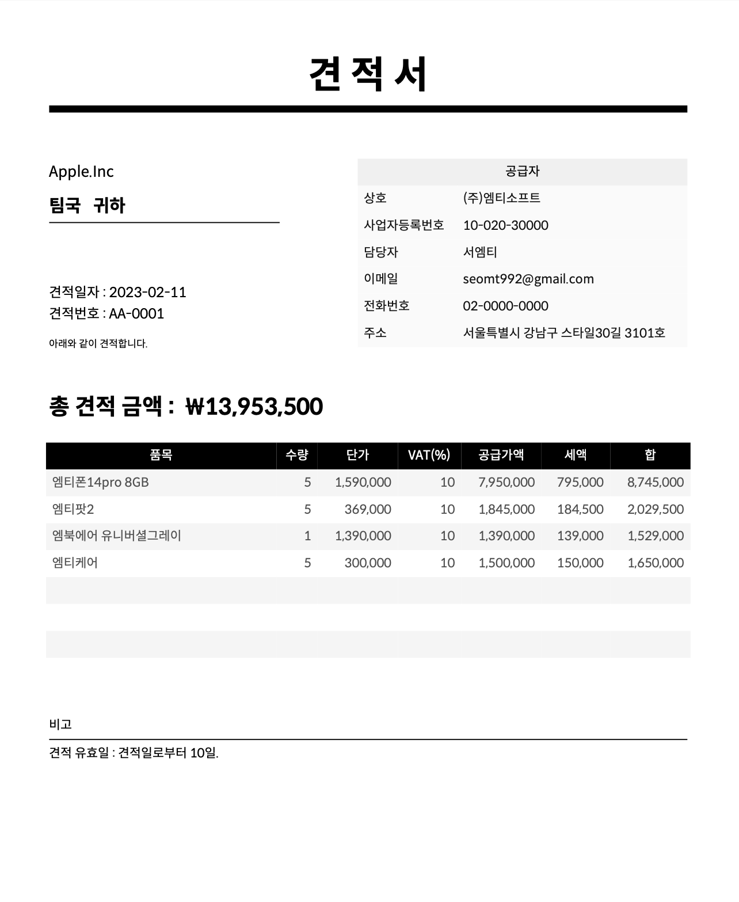
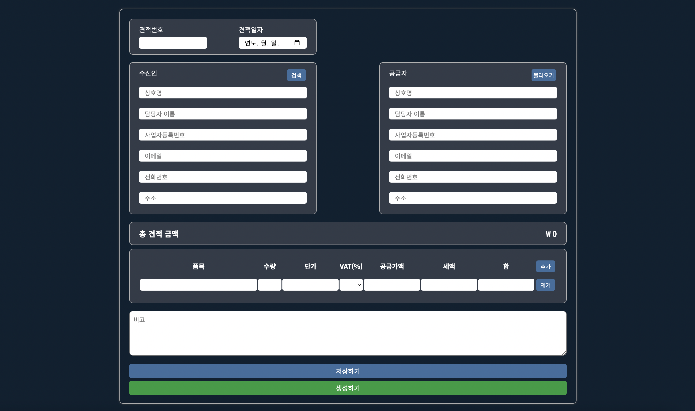
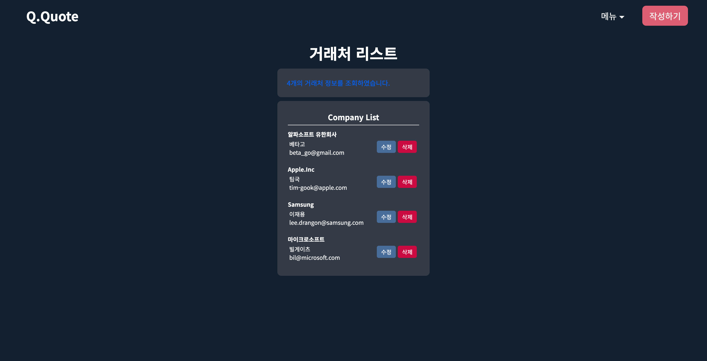
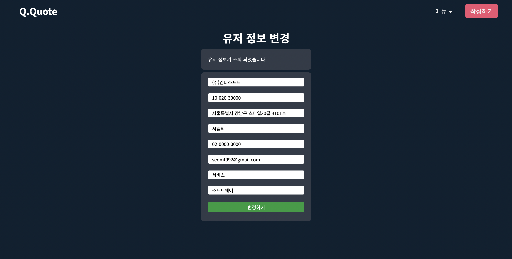
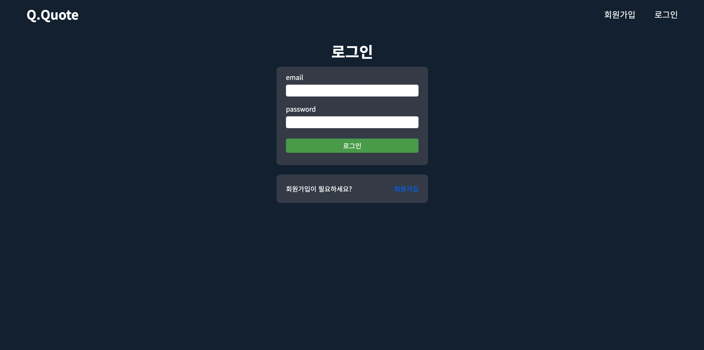

# Q.Q (Quick Quote)
'웹에서 쉽고 빠르게 견적서를 만들다'
 
 
작성한 견적서를 PDF파일로 다운로드할 수 있고 저장, 수정 그리고 삭제 할 수 있어 간편 관리가 가능합니다.
 
또한 유저 정보, 거래처 정보 관리 기능까지 있어 견적서를 보다 빠르게 작성할 수 있습니다.

 

## 제작 동기
견적서 작성이 필요한 개인사업자와 소규모 기업 담당자에게 도움이 되고자 제작하게 되었습니다.
 
 

## 개발 기간
- version 1.0.0 (2023-01-11 ~ 2023-02-11)
- [프론트엔드 코드 보기](https://github.com/mtseo01/quick-quote/tree/main/front#readme) / [백엔드 코드 보기](https://github.com/mtseo01/quick-quote/tree/main/back#readme)
  - 견적서
    - 다운로드 (기본 템플릿 제공)
    - 견적서 작성 / 저장 / 수정 / 삭제
    - 작성 시 유저 정보, 거래처 정보 불러오기 기능
  - 유저
    - 회원 가입 / 로그인 / 로그아웃 / 회원 정보 수정 / 비밀번호 변경 / 회원 탈퇴
  - 거래처
    - 거래처 생성 / 수정 / 삭제

- version 1.x.x (2023-02-11 ~ 개발 중)
 

## 기술 스택

### 프론트엔드(Front-end)
- Vue.js
  - 서버로부터 받은 응답 값 가공 및 화면 처리하였습니다.
  - 컴포넌트 재활용.
  - 컴포넌트 간에 데이터 전송. [코드 보기](https://github.com/mtseo01/quick-quote/blob/3094492d73da00d8d5623498ae7ccc25110ed77b/front/src/components/client/GetClients.vue#L30-L77)
- Vuex
  - 유저 상태 관리 [코드 보기](https://github.com/mtseo01/quick-quote/blob/main/front/src/store/index.js)
- Vue-router
  - 네이게이션 가드를 활용해 유저 상태에 따라 페이지 간 이동을 허용/제한하였습니다. [코드 보기](https://github.com/mtseo01/quick-quote/blob/3094492d73da00d8d5623498ae7ccc25110ed77b/front/src/router/index.js#L98-L111)
- Axios
  - API호출을 모듈화하여 중복 코드를 줄이고 재사용할 수 있게 하였습니다. [코드 보기](https://github.com/mtseo01/quick-quote/tree/main/front/src/api)
- jsPDF / js-autotable
  - 견적서 템플릿을 생성하고 클라이언트로부터 받은 데이터를 가공하여 PDF파일로 다운로드할 수 있게 하였습니다. [코드 보기](https://github.com/mtseo01/quick-quote/blob/main/front/src/utils/pdf.js)
 

### 백엔드(Back-end)
- Node.js / Express
  - MVC 패턴 중 Model과 Controller를 아래와 같이 구현하였습니다.
    - Model : MongoDB(Mongoose)를 이용해 스키마를 정의하였습니다. [목록 보기](https://github.com/mtseo01/quick-quote/tree/main/back/api/models)
    - Controller : 클라이언트 요청에 맞게 모델 데이터를 취급하거나 클라이언트에게 응답 값을 전달하는 로직을 작성하였습니다. [목록 보기](https://github.com/mtseo01/quick-quote/tree/main/back/api/controllers)
  - RESTful API를 설계하였습니다.
    - Users API (회원가입 / 회원탈퇴 / 회원정보 불러오기 / 회원정보 수정 / 비밀번호 변경)
      - 회원가입 [코드 보기](https://github.com/mtseo01/quick-quote/blob/3094492d73da00d8d5623498ae7ccc25110ed77b/back/api/controllers/user.js#L15-L52)
      - 회원탈퇴 [코드 보기](https://github.com/mtseo01/quick-quote/blob/3094492d73da00d8d5623498ae7ccc25110ed77b/back/api/controllers/user.js#L221-L271)
      - 회원정보 불러오기 [코드 보기](https://github.com/mtseo01/quick-quote/blob/3094492d73da00d8d5623498ae7ccc25110ed77b/back/api/controllers/user.js#L113-L140)
      - 회원정보 수정하기 [코드 보기](https://github.com/mtseo01/quick-quote/blob/3094492d73da00d8d5623498ae7ccc25110ed77b/back/api/controllers/user.js#L142-L159)
      - 비밀번호 변경하기 [코드 보기](https://github.com/mtseo01/quick-quote/blob/3094492d73da00d8d5623498ae7ccc25110ed77b/back/api/controllers/user.js#L161-L219)
    - Clients API (거래처 생성 / 거래처 정보 불러오기 / 수정 / 삭제)
      - 거래처 생성 [코드 보기](https://github.com/mtseo01/quick-quote/blob/3094492d73da00d8d5623498ae7ccc25110ed77b/back/api/controllers/client.js#L8-L43)
      - 모든 거래처 정보 불러오기 [코드 보기](https://github.com/mtseo01/quick-quote/blob/3094492d73da00d8d5623498ae7ccc25110ed77b/back/api/controllers/client.js#L45-L85)
      - 특정 거래처 정보 불러오기 [코드 보기](https://github.com/mtseo01/quick-quote/blob/3094492d73da00d8d5623498ae7ccc25110ed77b/back/api/controllers/client.js#L87-L115)
      - 거래처 수정 [코드 보기](https://github.com/mtseo01/quick-quote/blob/3094492d73da00d8d5623498ae7ccc25110ed77b/back/api/controllers/client.js#L117-L130)
      - 거래처 삭제 [코드 보기](https://github.com/mtseo01/quick-quote/blob/3094492d73da00d8d5623498ae7ccc25110ed77b/back/api/controllers/client.js#L132-L150)
    - Quotations API (견적서 생성 / 견적서 정보 불러오기 / 수정 / 삭제)
      - 견적서 생성 [코드 보기](https://github.com/mtseo01/quick-quote/blob/3094492d73da00d8d5623498ae7ccc25110ed77b/back/api/controllers/quotation.js#L7-L54)
      - 모든 견적서 정보 불러오기 [코드 보기](https://github.com/mtseo01/quick-quote/blob/3094492d73da00d8d5623498ae7ccc25110ed77b/back/api/controllers/quotation.js#L56-L81)
      - 특정 견적서 정보 불러오기 [코드 보기](https://github.com/mtseo01/quick-quote/blob/3094492d73da00d8d5623498ae7ccc25110ed77b/back/api/controllers/quotation.js#L83-L108)
      - 견적서 수정 [코드 보기](https://github.com/mtseo01/quick-quote/blob/3094492d73da00d8d5623498ae7ccc25110ed77b/back/api/controllers/quotation.js#L110-L127)
      - 견적서 삭제 [코드 보기](https://github.com/mtseo01/quick-quote/blob/3094492d73da00d8d5623498ae7ccc25110ed77b/back/api/controllers/quotation.js#L129-L147)
 

### 툴(Tool)
- Git / Github
  - 형상 관리
- Postman
  - 백엔드API를 테스트하는데 활용하였습니다. 
 

## 결과물 및 일부 페이지 이미지
 
견적서 PDF 파일 캡쳐

 
견적서 작성 페이지

 
거래처 목록 페이지

 
유저 정보 수정 페이지

 
로그인 페이지
