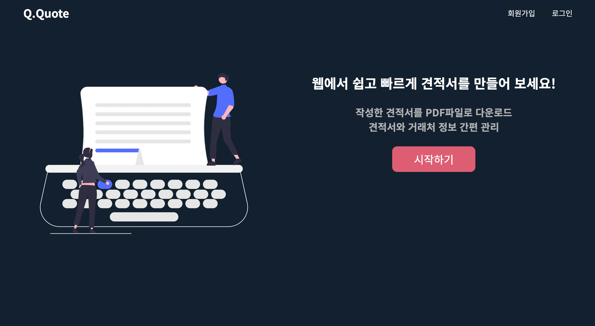
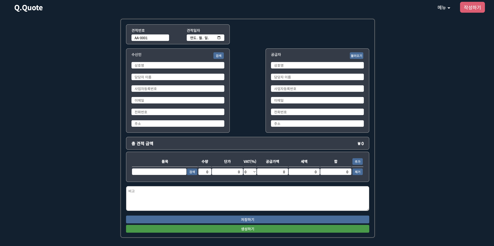

# Q.Q (Quick Quote)
'웹에서 쉽고 빠르게 견적서를 만들다'
 
 
작성한 견적서를 PDF파일로 다운로드할 수 있고 저장, 수정 그리고 삭제 할 수 있어 간편 관리가 가능합니다.
 
또한 유저 정보, 거래처 정보 관리 기능까지 있어 견적서를 보다 빠르게 작성할 수 있습니다.

 

## 제작 동기
견적서 작성이 필요한 개인사업자와 소규모 기업 담당자에게 도움이 되고자 제작하게 되었습니다.
 
 

## 개발 기간
- version 1.0.0 (2023-01-11 ~ 2023-02-11)

기능 자세히 보기

- version 1.0.0 기능
  - 견적서
    - 다운로드 (기본 템플릿 제공)
    - 견적서 작성 / 저장 / 수정 / 삭제
    - 작성 시 유저 정보, 거래처 정보 불러오기 기능
  - 유저
    - 회원 가입 / 로그인 / 로그아웃 / 회원 정보 수정 / 비밀번호 변경 / 회원 탈퇴
  - 거래처
    - 거래처 생성 / 수정 / 삭제

- version 1.x.x (2023-02-11 ~ 개발 중)
 

## 기술 스택

### 프론트엔드(Front-end)
- Vue.js
  - 서버로부터 받은 응답 값 가공 및 화면 처리하였습니다.
  - 컴포넌트 재활용.
  - 컴포넌트 간에 데이터 전송.
- Vuex
  - 유저 상태 관리
- Vue-router
  - 네이게이션 가드를 활용해 유저 상태에 따라 페이지 간 이동을 허용/제한하였습니다.
- Axios
  - API호출을 모듈화하여 중복 코드를 줄이고 재사용할 수 있게 하였습니다.
- jsPDF / js-autotable
  - 견적서 템플릿을 생성하고 클라이언트로부터 받은 데이터를 가공하여 PDF파일로 다운로드할 수 있게 하였습니다.
 

### 백엔드(Back-end)
- Node.js / Express
  - MVC 패턴 중 Model과 Controller를 아래와 같이 구현하였습니다.
    - Model : MongoDB(Mongoose)를 이용해 스키마를 정의하였습니다.
    - Controller : 클라이언트 요청에 맞게 모델 데이터를 취급하거나 클라이언트에게 응답 값을 전달하는 로직을 작성하였습니다.
  - RESTful API를 설계하였습니다.
    - Users API (회원가입 / 회원탈퇴 / 회원정보 불러오기 / 회원정보 수정 / 비밀번호 변경)
    - Clients API (거래처 생성 / 거래처 정보 불러오기 / 수정 / 삭제)
    - Quotations API (견적서 저장 / 견적서 정보 불러오기 / 수정 / 삭제)
 

### 툴(Tool)
- Git / Github
  - 형상 관리
- Postman
  - 백엔드API를 테스트하는데 활용하였습니다. 
 

## 결과물 및 일부 페이지 이미지
 
견적서 PDF 파일 캡쳐

 
견적서 작성 페이지

 
거래처 목록 페이지

 
유저 정보 수정 페이지

 
로그인 페이지
